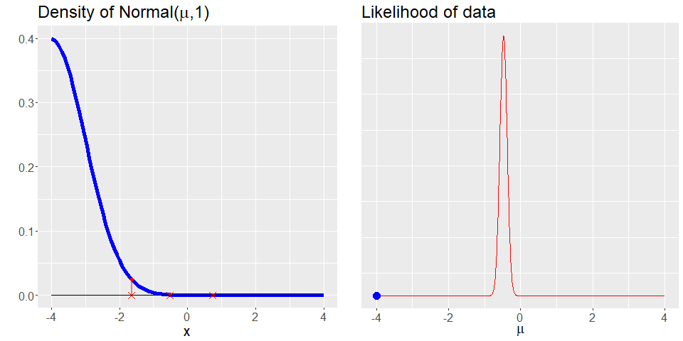

# Visualizing the likelihood function

**Author**: Jonathan Che

**Affiliation**: Ph.D. Statistics student, Harvard University

**Artifact:** [Link to Shiny web app](https://jche.shinyapps.io/likelihood-animation/)

**Code:** [Code from repo](jonathanche_code.R)

### Explanation

This visualization helps to build a more intuitive understanding of XYZ. This is because...
